# Real Estate Tokenization Platform based on the CEP-78 Standard with account whitelisting

This repository delivers Milestone 3 of the DEVxDAO Real Estate Tokenization Platform grant 225, titled "An Open Source Smart Contract Market Model for Tokenized Real Estates".
It relies on the Casper CEP-78 token standard provided in milestone 2 and in the repository [DEVxDAO-m2](https://github.com/NoumenaDigital/DEVxDAO-m2).

## Table of Contents
1. Background Information
    1. Context
    2. Summary of Core Requirements
    3. Fulfillment of Core Requirements
2. Code Documentation
   1. Architecture Description
   2. Noumena Platform NPL Documentation
   3. Building and testing on the local environment
   4. Demo & testing instructions


## Background Information

### Context

In the scope of this project, a full prototype of a Real Estate Investment Platform (RE Platform) that enables democratization and decentralization
of real estate investments has been implemented. This RE Platform utilizes off-chain smart contracts implemented in the Noumena Protocol
Language (NPL) to handle complex business logic and sensitive data. These off-chain smart-contracts are used to manage
on-chain smart contracts which control actions on the Casper blockchain itself e.g. mint, burn, transfer of tokens representing
the real estate assets, etc.

Milestone 3 aims at delivering an end-to-end model of the real estate market infrastructure. This includes: 
- the creation of Real Estate Investment projects, also called Real Estate Investment Special Purpose Vehicles - RE SPV
- the selection of potential investors by the bank
- the creation of on-chain tokens representing the investor's investment and supporting off-chain smart contracts, that handle detailed information and business logic
- the transfer of such an investment token from one investor to another cleared investor

Milestone 3 utilizes the newly added functionality of whitelisting accounts introduced in [Milestone 2](https://github.com/NoumenaDigital/DEVxDAO∂∂-m2) 
to validate that the counterpart to a specific secondary trade of a token representing a real estate investment has signed all necessary 
documents (NDAs, Shareholder Agreements, ...) and fulfills all legal requirements (Lex Koller, professional investor, ...) to receive such a token.

For a detailed description of the user journeys, please refer to Milestone 1 of this grant.
Milestone 4 will provide insights on feedback obtained from stakeholders as well as a legal perspective on the prototype, 
while a comprehensive white paper on how to utilize smart contracts and tokens for the digitization and democratization of 
Real Estate Investments in Switzerland will be delivered with Milestone 5.

### Summary of Requirements

As outlined in the grant proposal, the requirements are as follows:

The focus is set on end-to-end modeling of a comprehensive model of the real estate market infrastructure. 
The scope includes key elements of the onboarding of real estate assets, initial due diligence and the issuance of tokens 
over the trading and settlement of real estate tokens to the “holding” thereof.
1. Roles required for an efficient blockchain and smart contract-based market infrastructure will be defined. 
2. Key elements of the processes and contracts involved in the onboarding, trading and holding phases are modeled as smart contracts. 
3. Example smart contracts support the following processes:
   - Real estate token issuance and placement process 
   - Tokenholders' agreement implementation 
   - Trade validation and settlement process 
   - Token servicing process

### Fulfillment of Core Requirements

#### 1. Roles required for an efficient blockchain and smart contract-based market infrastructure will be defined.  

The following roles have been implemented in the prototype:   

| NPL Role     | Description                                                                                                                                                                                                                   | Casper Account                     |
|---------------|-------------------------------------------------------------------------------------------------------------------------------------------------------------------------------------------------------------------------------|------------------------------------|
| **pBank**     | Represents the bank that conducts the due diligence and selects the investors for the specific Real Estate SPV. The bank issues the RE SPV tokens. The bank is furthermore in charge of managing the lifecycle of the RE SPV. | No account, acts through pPlatform |
| **pPlatform** | Represents the Real Estate Investment platform itself. The Real Estate Investment platform hosts RE SPVs, banks and investors and facilitates the interactions between them.                                                  | Contract Installer Account         |
| **pInvestor** | Represents the investor who signs the required legal documents with the bank and acquires Real Estate Investment equity on the primary and/or secondary market.                                                               | Investor Account                   |
| **pBuyer**    | The role of the investor who is party to a Trade Agreement and intent on buying equity represented by a Casper Token in a RE SPV.                                                                                             | Investor Account                   |
| **pSeller**   | The role of the investor who is party to a Trade Agreement and intent on selling his equity represented by a Casper Token in a RE SPV.                                                                                        | Investor Account                   |

#### 2. Key elements of the processes and contracts involved in the onboarding, trading and holding phases are modeled as smart contracts.  

The implemented prototype covers the fundamental processes of a Real Estate Tokenization platform. This includes:

- The platform represents a RE SPV as a "project" smart protocol on the platform.
- The bank can structure the project by means of a dataroom holding information on the project developer, the project itself, the due diligence outcome and the shareholder agreement.
- The bank can manage potential investors by validating them for legal compliance, blacklisting them or selecting them for obtaining offers to invest in the project
- The platform manages the sent out offers, reminding investors who have not responded about the offers automatically and excluding blacklisted investors
- Investors have the capability to reject, accept and ignore investment offers. 
- Upon accepting an offer, the respective investor needs to sign a non-disclosure agreement and a shareholder agreement, which amongst other criteria such as Lex Koller, then permits him to become whitelisted on the project and thus receive an investment token.
- When reaching the offer deadline, the platform automatically mints on-chain tokens (representing the ownership of the investment) and 
off-chain smart contracts (orchestrating the associated business logic) for the investments. The relationship of these two tokens is explained further in the section *Role Of Noumena Platform*
- In case of oversubscription, the platform automatically assigns investments based on a first come first serve methodology. 
Investors that did not receive an investment, because they were too late, remain whitelisted and can thus obtain an investment on the secondary market. 
- The platform permits investors to transfer investments to other investors through a secondary market transfer. The prerequisite 
is, that the counterpart to the transfer is whitelisted and thus complies with all legal requirements and has signed all necessary documents. 

  
 #### 3. Examples smart contracts support the following processes:
| Example | Respective Protocols                             | Respective Files |
| ------- |--------------------------------------------------| ---------------- |
| Real estate token issuance and placement process | Project, ProjectDataroom, Token, SubscriptionOffer           | project.npl, project_dataroom.npl, token.npl, offer.npl |
| Tokenholders' agreement implementation | NDA, ShareholderAgreement, SubscriptionAgreement | nonDisclosureAgreement.npl, shareholderAgreement.npl, subscriptionAgreement.npl |
| Trade validation and settlement process | Project, SubscriptionOffer, TradeAgreement | project.npl, offer.npl, tradeAgreement.npl |
| Token servicing process | Token | token.npl |


## Code Documentation

### Architecture Description 

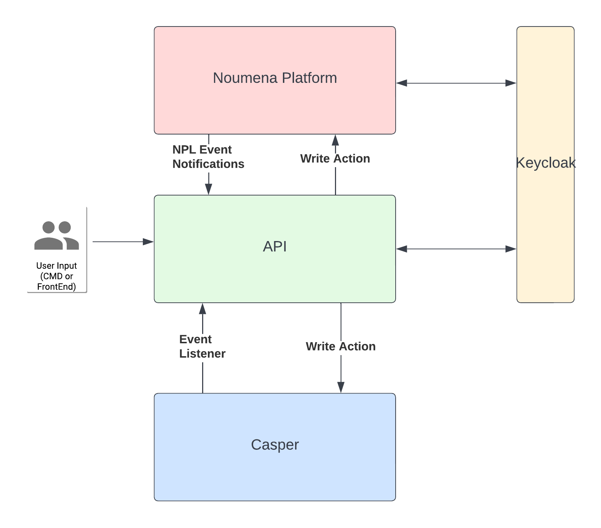

#### Role of the Noumena Platform

The Noumena Platform acts as an orchestration layer on top of the Casper Blockchain. Through the use of the Noumena Platform 
and the Noumena Protocol Language, it creates an ecosystem of off-chain smart contracts that embody the Real Estate Investment
Platform. Amongst others it also holds a smart protocol that represents a specific Real Estate Investment Special Purpose Vehicle
(protocol: Project, file: Project.npl), a smart protocol that represents the investor (protocol: Investor, file: Investor.npl) and 
a smart protocol that represent the investment as an off-chain smart contract (protocol: Token, file: Token.npl).

The Project protocol is replicated on Casper, where it holds a whitelist of investors which are permitted to hold tokens 
in the Real Estate Investment SPV. Amongst a variety of data and logic, the investor protocol also holds the account number for the Casper account linked to the 
specific investor.
The off-chain smart contract protocol is directly linked to an on-chain token stored on Casper and thus holds its Casper ID in the field "bcId".

#### Role of API

The API acts as the middle layer between Casper and the Noumena Platform. Any external actions, be it through the command line 
or a future Front End for the platform, is initially handled by the API. 

The API listens continuously to Casper to detect actions which originate from Casper, such as an on-chain transfer of a token. 
It also listens to the Noumena Notifications Stream for any actions taken in the Noumena Platform, such as an off-chain transfer of a token. 

The API furthermore initiates actions in both the Noumena Platform or in Casper. For example it installs a smart contract on the blockchain when a 
new Real Estate Investment project is created in the Noumena Platform, adds and removes whitelisted accounts or triggers an on-chain transaction on the Casper blockchain, when 
an investor transfers a token within Casper without using the Real Estate Investment platform. The ability to do the latter is a requirement by the Swiss DLT Law. 

RedHat Keycloak has been used for authorization and authentication of the access on the Noumena Platform. The Keycloak service is holding all user's profiles and provides JSON Web Tokens (JWT) necessary for the API accessing the Noumena Platform.

#### Role of Casper

When a new Real Estate SPV is available for investment, a respective project is created in the Noumena Platform. This immediately 
triggers the installation of a smart contract on the Casper blockchain. The main purpose of this smart contract is to hold and maintain 
a list of whitelisted investor accounts that are permitted to hold tokens in the Real Estate Investments. 

Furthermore, Casper holds the on-chain CEP-78 based token which is minted when an investor places an investment in the RE SPV, e.g. after confirmation of the subscription to the SPV by the bank. 
This token represents the ownership in the Real Estate SPV and can be transferred on the chain to a different 
account holder, provided that said account holder is whitelisted on the project stored on Casper.

The token which was developed in Milestone 2 of this grant, was further enhanced in order to enable the acceptance
of a token id (or hash), which is passed on token creation and can be arbitrary. This required adding a new argument to 
the minting entry point.

### Noumena Platform NPL Documentation

#### NPL Protocol Documentation

| Protocol                     | Purpose                                                                                                                                                                                                                                                                                                                                                                                          | Involved Parties            |
|------------------------------|--------------------------------------------------------------------------------------------------------------------------------------------------------------------------------------------------------------------------------------------------------------------------------------------------------------------------------------------------------------------------------------------------|-----------------------------|
| ShareClass                   | The ShareClass protocol holds or references all information with regards to the conditions of the share class, any holdings in the share class and any outstanding offers. It defines all business logic with regards to the share class, such as the permission to confirm subscriptions.                                                                                                       | pBank                       |
| Token                        | The Token protocol is the off-chain twin to the Casper token guaranteeing the investment in a Real Estate SPV. It contains information with regards to the size of the investment, which is not available in the on-chain token due to investors risking this becoming public. It also contains any permissions with regards to transferring the ownership of the investment to other investors. | pBank, pOwner               |
| Investor                     | The Investor protocol holds the client identifying data for the investors, data with regards to his compliance with the law (e.g. Lex Koller), a reference to the wallet of the investor and references to any agreements, he may have signed or accepted.                                                                                                                                       | pBank, pPlatform, pInvestor |
| NDA                          | Agreement between Bank and Investor assuring that the Investor will not disclose any information with regards to the RE SPV to third parties                                                                                                                                                                                                                                                     | pBank, PInvestor            |
| ShareholderAgreement         | An agreement signed between the Bank and the Investor prior after accepting an offer for an investment in a RE SPV or prior to accepting a secondary market transfer. The shareholder agreement outlines the terms that govern the ongoing relationship between shareholders.                                                                                                                    | pBank, pInvestor            |
| SubscriptionAgreement        | An agreement between the Bank and Investor which outlines a specific intent to purchase shares on the primary market. It outlines the original committed number of shares as well as the number of allocated shares.                                                                                                                                                                             | pBank, pInvestor            |
| Project                      | A smart protocol representing a specific RE SPV. It references all the data for the project which is stored in the dataroom, permits the creation and storing of share classes and manages the whitelisted investors on the Casper chain.                                                                                                                                                        | pBank, pInvestor            |
| ProjectDataroom              | A smart protocol, that acts as a library for all data associated with the project. It contains a list of data assets, jointly known as a union as ProjectDataroomData. The data in this project can only be accessed once an investor has signed an NDA.                                                                                                                                         | pPlatform, pBank            |
| ProjectDeveloperData         | A smart protocol containing data on the developer of the real estate project.                                                                                                                                                                                                                                                                                                                    | pPlatform, pBank            |
| ProjectData                  | A smart protocol containing data on the project itself.                                                                                                                                                                                                                                                                                                                                          | pPlatform, pBank            |
| DueDilligencePackage         | A smart protocol containing data on the outcome of the due diligence conducted by the bank.                                                                                                                                                                                                                                                                                                      | pPlatform, pBank            |
| ShareholderAgreementTemplate | A smart protocol containing the information outlined in the Shareholder Agreement, making it visible to the investor when he has signed the NDA.                                                                                                                                                                                                                                                 | pPlatform, pBank            |
| PremiumData                  | Any premium data associated to the project that might be made available.                                                                                                                                                                                                                                                                                                                         | pPlatform, pBank            |
| SubscriptionOffer            | This protocol represents the offer sent to potential investors outlining specific offer conditions, such as the share price, a minimum commitment in terms of number of shares and a maximum commitment in terms of number of shares. It also has permissions for the investor to accept or decline the offer.                                                                                   | pBank, pPlatform, pInvestor |
| OffChainTradeAgreement       | This protocol is instantiated when an investor initiates a transfer of one of his tokens to a different investor through the Real Estate Platform (off-chain). It conducts various checks to make sure that the counterpart receiving the token, fulfills all legal requirements and has signed all necessary documents.                                                                         | pBank, pSeller, pBuyer      |
| OnChainTradeAgreement        | This protocol is instantiated when an investor initiates a transfer of one of his tokens to a different investor through the Casper blockchain (on-chain). In this case all relevant checks have already been done on the chain and are thus no longer necessary in the Real Estate Platform.                                                                                                    | pBank, pSeller, pBuyer      |
| Wallet                       | Each Investor protocol has a Wallet protocol associated with it. The wallet protocol holds all the tokens and the fiat currency of the investor.                                                                                                                                                                                                                                                 |                             |

#### npl_demo.npl (npl/src/test/npl/demo/npl_demo.npl)

This demo file applies only to testing, debugging and developing the NPL portion of the solution. For a holistic testing of the whole
solution, [demo.npl](npl/src/main/npl/demo/demo.npl) is used. This is described in the *Demo & Testing Instructions* section of this README.

This demo file contains a scenario including all main steps developed during this prototype. It tests purely the Noumena platform. 
For the NPL code which run during the integration test or within the testing environment, refer to demo.npl.

The npl-demo.npl is run automatically as a part of the build process of the provided test environment.  

### Building and testing on the local environment

There are the tests in the Casper Directory for the smart contract, which can be executed from within `casper` directory.
For details, please see `casper/README.md` in `Building and testing on the local environment` section.
For the tests on the Noumena Protocol Language and the API module tests, this requires a copy of the Noumena Platform. 
As the Noumena Platform is proprietary, this would require a license. The tests are run automatically in the environment 
as defined in `.github/workflows/on-push.yml` Github action.
To obtain a license for the Noumena Platform, please reach out to info@noumenadigital.com.


### Demo & Testing Instructions

The demo environment is deployed as a part of the Noumena infrastructure, the API can be found under URL:

https://api.devxdao-dev.noumenadigital.com/

In order to execute the demo one needs to invoke a few endpoints in the correct order and with correct input data.
Note that all API (and only API) exposed endpoints are open and, for the sake of the review process and its requirements, do not require a JWT.

For all the steps below, test accounts are needed. To simplify the testing, pre-existing test accounts are provided:

| account   | account hash reference                   | test account hash                                                 |
|-----------|------------------------------------------|-------------------------------------------------------------------|
| account 1 | account-hash-\<INVESTOR_ACCOUNT_HASH_1\> | b16a8260da3f5fb760e1cec6afafe9429ef6c61f43b65339106268071b1eab5f  |
| account 2 | account-hash-\<INVESTOR_ACCOUNT_HASH_2\> | 5afd6629b0072e4c3d039566706572a9a0afbb3a55f26467ac6fe54f1794414e  |
| account 3 | account-hash-\<INVESTOR_ACCOUNT_HASH_3\> | cd108b67ad506ef767d2ddd0da063e29f3e5167a1693b4ad9899ae74c440b3c8  |
| account 4 | account-hash-\<INVESTOR_ACCOUNT_HASH_4\> | 1c50e7940739bab2cf21f8c7cf8d2512e2c7e48d6723464c308adc1c9341512b  |

A list of endpoints and their description can be found below.

The following are the steps that are to be executed when running the demo:

1. #### Create demo NPL protocol contract
```shell
curl -k -X POST https://api.devxdao-dev.noumenadigital.com/dx/demo
```

Invoking this endpoint will create `Demo` NPL protocol in the Noumena Platform and return its protocol id, e.g.:

```shell
{"protocolId":"ec9c90e8-a3f6-4d30-8151-8d7a39a80e1b","value":"[/dx-1.0.0?/demo/Demo]"}
```

Note down the `protocolId` as it is needed in the next steps.

**Context**

This step has set up a Demo protocol within the Noumena Platform that will run through a full Real Estate Tokenization Example 
from project setup to final transfer of a minted token from one investor to another. 

2. #### Set up project
```shell
curl -k -X POST https://api.devxdao-dev.noumenadigital.com/dx/demo/<PROTOCOL_ID>/setupProject -d \
'{"account1":"<INVESTOR_ACCOUNT_HASH_1>","account2":"<INVESTOR_ACCOUNT_HASH_2>","account3":"<INVESTOR_ACCOUNT_HASH_3>","account4":"<INVESTOR_ACCOUNT_HASH_4>"}'
```
where:
* <PROTOCOL_ID> is the `potocolId` from the response in the previous step. Please plus the Protocol ID from step 1 in here. 
* `<INVESTOR_ACCOUNT_HASH_1>..<INVESTOR_ACCOUNT_HASH_4>` are hashes of Casper accounts involved in the demo. These can be replaced with own account hashes or with the 4 provided above. 

For simplicity the 4 account hashes above are already replaced in the following command:

````shell
curl -k -X POST https://api.devxdao-dev.noumenadigital.com/dx/demo/<PROTOCOL_ID>/setupProject -d \
'{"account1":"b16a8260da3f5fb760e1cec6afafe9429ef6c61f43b65339106268071b1eab5f","account2":"5afd6629b0072e4c3d039566706572a9a0afbb3a55f26467ac6fe54f1794414e","account3":"cd108b67ad506ef767d2ddd0da063e29f3e5167a1693b4ad9899ae74c440b3c8","account4":"1c50e7940739bab2cf21f8c7cf8d2512e2c7e48d6723464c308adc1c9341512b"}'
````

Calling this endpoint will set up the project in the Noumena Platform. When project is created, the Noumena Platform 
notifies the API about that fact and then the API requests an installation of new Casper enhanced CEP-78 contract.

Note that the Casper `installer` account is bound to the demo environment deployment and its account hash is `a18ccfa04c2dde6f7725cc4f67069d1678a5f8fce4b785ec8d10a6094a6892d7`. Its current state with deployments and invoked endpoints can be found under https://integration.cspr.live/account/011945b27227277b474fe40bcb423b3808ae884a8181f197eb1b20cb9304f80a2e. Go to this url and check if the contract has been deployed. It usually takes 2 - 3 minutes until that happens.
The message that is expected to be seen at the top of `Deploys` list is **WASM deploy** as in the following image:

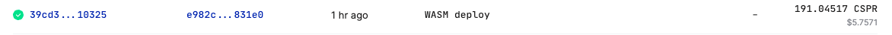

One can explore the values on the contract by selecting the Named Keys Section on the above site and clicking on the value for the NFT contract. The below image shows what this would look like:
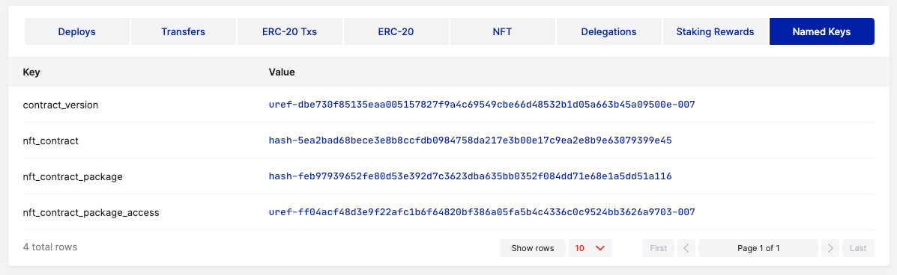

**Context**

Within this step, a project was set up on the Noumena Platform, representing a Real Estate Equity opportunity. The Project
was then structured with various data on the project developer, the project itself, the due diligence and the shareholder agreement in the respective dataroom. 
Furthermore a share class was set up, defining the parameters of the shares that investors can buy and that will be tokenized on the Casper chain. 
The bank furthermore selected 4 investors that received offers from the bank for investment, verified that these comply to all 
regulatory requirements and sent them offers for investment. 
All of this happens withing the permission `setupProject` on line `16`of `demo.npl`.
The next steps which include the reactions of the investors, will be covered in Step 3. 

3. #### Set up investors
Calling

```shell
curl -k -X POST https://api.devxdao-dev.noumenadigital.com/dx/demo/<PROTOCOL_ID>/setupInvestors
```

will set up investors and add them as whitelisted accounts to the Casper contract. Before moving to the next step, 
ensure that the `add_to_account_whitelist` endpoint has been invoked three times for `account1..account3` on the 
deployed Casper contract (installer account):

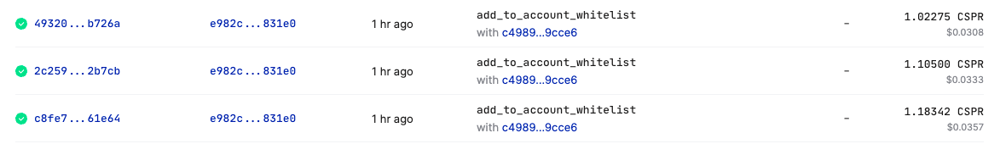

**Context** 
Within this step, the first investor accepted the offer stright away and signed the NDA and all further legal documents. 
He thus obtained a subscription agreement. The other requirements waited for some time and thus were sent a Reminder concerning the offer. 
The second investor declined the offer and the third one also accepted the offer. Furthermore, this step sets up a 4th investor 
and signs all relevant documents to whitelist this investor, so that he can receive a transfer from the first investor in the 
last step of this demo. All of this happens within the permission `selectInvestors` on line `92` of `demo.npl`.

By checking the contract online, one should now see `account1`, `account3` and `account4` of the above accounts whitelisted. 

`account3` has denied the offer and is thus not whitelisted.

This is done by following the same step in accessing the contract as outlined in step 1 and then on the Contract Page again 
selecting the Value for account_whitelist under Named Keys. The result should look as follows:

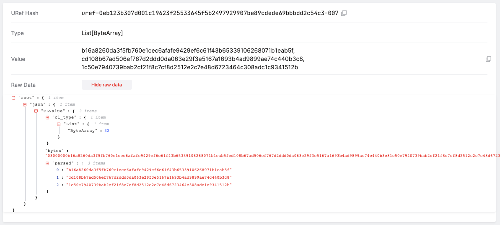

The next steps which include the minting of tokens on Casper, will be covered in Step 5.

4. #### Set up tokens
Once the investors are added to the whitelist, the process can continue with setting and creating the token:

```shell
curl -k -X POST https://api.devxdao-dev.noumenadigital.com/dx/demo/<PROTOCOL_ID>/setupToken
```

Go to `https://integration.cspr.live/account/011945b27227277b474fe40bcb423b3808ae884a8181f197eb1b20cb9304f80a2e` and 
confirm that after few minutes, two token have been minted:

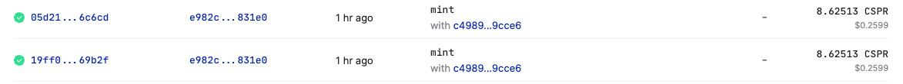

Note those tokens' `token_id_hash` from their `session` in `deploy`, e.g.:

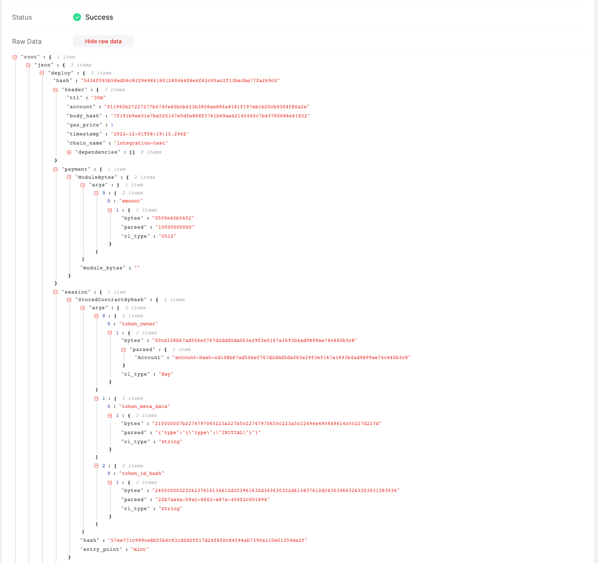

By using the `token_id_hash` it can be checked that the investors own minted tokens. In order to 
confirm the ownership, go to `Named Keys` on the NFT contract and look for `token_owners` dictionary (one might have to scroll to the next pages or extend the list size):

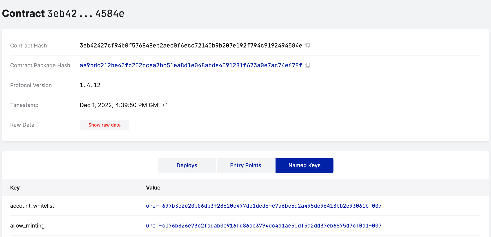
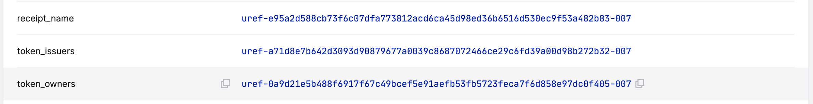

Then navigate to this dictionary and search for the `token_id_hash` noted from `deploy` to
see the owners of the two minted tokens:

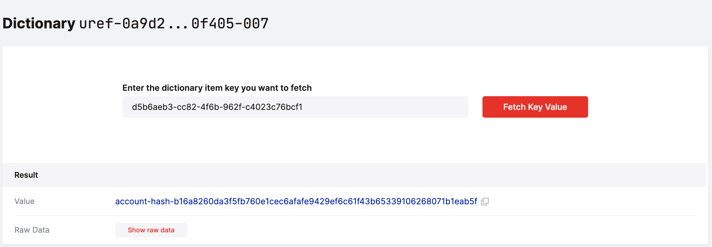
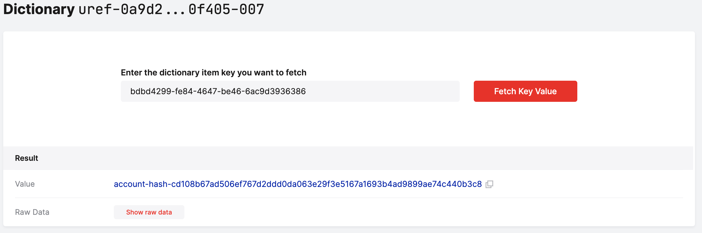

**Context**

Within this step, off-chain and on-chain Tokens are minted for all investments. Since only `account1` and `account2` have accepted
the offer from the bank, only those two should receive tokens on the chain. We thus expect two tokens on the chain with a reference to the
off-chain tokens. For obfuscation reasons, the off-chain tokens then hold the number of shares that are held by each account, while
the on-chain token holds the claim to these shares.
All of this happens withing the permission `setupToken` on line `128`of `demo.npl`.

The next steps which include the transfer of the token from one investor to the other, will be covered in Step 5.

5. #### Transfer token
Newly minted tokens can be transferred from one investor to another whitelisted investor using the following endpoint:

```shell
curl -k -X POST https://api.devxdao-dev.noumenadigital.com/dx/demo/<PROTOCOL_ID>/transferToken -d \
'{"accountBuyer":"<INVESTOR_ACCOUNT_HASH_4>"}'
```

This will transfer the token held by investor 1 (`account1`) to investor 4 (`account4`).

The <INVESTOR_ACCOUNT_HASH_4> is the same, which was passed in setting up the project in step 1. Check that after the `transfer` endpoint is called in the `token_owners` named key collection the token previously owned by `account1` is now owned by `account4`.

For the simplicity, the buyer account is already replaced with `account4` hash in the following command:

```shell
curl -k -X POST https://api.devxdao-dev.noumenadigital.com/dx/demo/<PROTOCOL_ID>/transferToken -d \
'{"accountBuyer":"1c50e7940739bab2cf21f8c7cf8d2512e2c7e48d6723464c308adc1c9341512b"}'
```

When the transfer is completed, it can be checked that the ownership of the token
has been transferred. Similarly to the previous step, navigate to `token_owners` dictionary and check that one 
of the token is now owned by te `accountBuyer`:

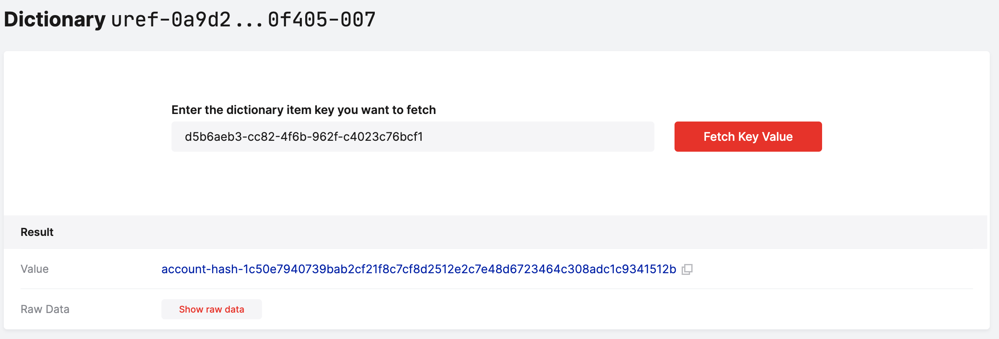

**Context**

Within this step, the token from Investor 1 (`account1`) was transfered to Investor 4 (`account4`) who was cleared for receiving 
tokens and added to the whitelist in Step 3.
Both Investor 1 and Investor 4 had to explicitly agree to the transfer within the Noumena Platform. Once both agree, the transfer was
automatically initiated.
All of this happens withing the permission `transferToken` on line `136`of `demo.npl`.

With this the demo of the Real Estate Equity Financing Platform is completed. 
