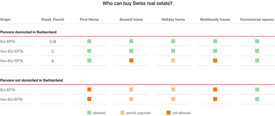

# Business stakeholder and legal considerations relevant to the Open Source Smart Contract Market Model for Tokenized Real Estates

This document provides a concise depiction of critical business and legal considerations that were made during the development of the Open Source Smart Contract Market Model for Tokenized Real Estates.

## Table of Contents
1. Disclaimer 
   1. Assumptions
2. Business Considerations
   1. Obfuscation/Anonymity
   2. Transfer restrictions
3. Legal Considerations 
   1. Requirements & Limitations with regards to the Ownership of Tokenized Shares in a Real Estate SPV
   2. Requirements with regards to the Swiss DLT Law
   3. Requirements with regards to the taxation of Tokenized Shares in a Real Estate SPV
   4. Requirements with regards to Data Protection for Tokenized Shares in a Real Estate SPV 
4. Conclusion

## Disclaimer
Various business stakeholders, such as insurance companies, banks and real estate experts as well as legal experts were involved. Due to the open source nature of this document, their respective names and identities were asked to be kept confidential. Nonetheless, their expertise helped shape this document and the related Smart Contract based Market Model for Tokenized Real Estates.

This document aims at providing a comprehensive view of the key considerations that are to be made from a business and legal perspective. However, no guarantees can be given with regards to the exhaustiveness nor the accuracy of all statements.

### Assumptions
1.	The scope of this document applies to the Swiss market and to Swiss regulations as was outlined in the grant proposal for this grant. Any considerations with regards to non-Swiss regulations or non-Swiss adopted regulations are excluded.
2.	While this document will outline some of the responsibilities of the various actors on the platform, such as the banks as the issuers and the project developers, their respective responsibilities shall be treated as their own and not as that of the platform.
3.	The initial platform version only targets professional investors (FinSA) and qualified investors (CISA). Specific rules applying to retail investors, such as the provision of a KID (PRIIPS) thus do not apply. It is planned to extend the offering as well to retail clients in a later stage to foster democratization of such investments but for the first version time to market is key and therefore it has been decided to focus on qualified and or professional investors.
4.	The platform excludes investors considered as U.S. persons as is common practice in the Swiss financial industry due to the various complications with regards to U.S. requirements to report any assets held by U.S persons to the U.S. Department of Treasury

## Business Considerations
The following core requirements have been gathered from the involved parties (primarily project developers, investment managers, banks and investors):

### Obfuscation/Anonymity
The Token on the blockchain may not hold sensitive information to ensure the investment and identity related information remains private. Most companies for example must not and don't want to disclose their cap table and most investors do not want to disclose their holdings or their trades.
The NFT in form of the enhanced CEP-78 standard ensures this by representing the total number of shares the investor owns and stores this information not on the chain itself, but in a privacy preserving off-chain smart contract on the investment platform. The token thus guarantees the ownership, while obfuscating the investment and personal data associated with it.
### Transfer restrictions
Legal restrictions with regards to investors such as having to be a professional investor under MIFID II, federal land ownership restrictions and other restrictions must be adhered to.

Through the enhancement of the CEP-78 standard with the whitelist of accounts, it can be ensured that legal restrictions with regards to investors such as having to be a professional investor under MIFID II, federal land ownership restrictions and other restrictions are adhered to.

## Legal Considerations

This paragraph provides a perspective of our current understanding on the legal considerations and requirements within Switzerland for a real estate market as the one created in this grant.
There is no guarantee of exhaustiveness and no liability can be carried with regards to the statements below.


All actions and undertakings within Switzerland oblige the Swiss Civil Code, the Swiss Code of Obligations and the Swiss Criminal Code. Other than that, the following table provides a list of legal documents covering the acquisition, holding and disposal of real estate and financial instruments in Switzerland.

| Regulation | Full Name | Regulatory Reach | Implications                                                                                                                                     | Responsibility of: |
|----|----|----|--------------------------------------------------------------------------------------------------------------------------------------------------|--------------------| 
| FinSA | Financial Services Act | CH | FinSA governs the provision of financial services as well as the offering of financial instruments. It intends to strengthen investor protection | Bank               |
| FinIA | Financial Institutions Act | CH | FinIA introduces supervisory rules for various types of financial institutions | 	Bank              |
| CISA | Collective Investment Schemes Act | CH | Regulation with regards to Limited Qualified Investor Fund (L-QIF) which is only open to qualified investors                                     | 	Bank              |
| PRIIPS | Packaged retail investment and insurance products | EEA | Regulation on Packages Retail Investment and Insurance Products, affecting solely retail clients                                                 | 	Bank              |
| Lex Koller | Act on the Acquisition of Real Estate by Persons Abroad | CH | Regulation covering the rules with regards to foreign individuals investing in swiss Real Estate properties                                      | 	Bank              |
| FATCA | Foreign Account Tax Compliance Act | Global | Reporting of assets held by individuals linked to the US (birth, nationality, …) to the U.S. Department of the Treasury                          | 	Bank              |
| GDPR | Global Data Protection Regulation	Global | EU | privacy law and of human rights law                                                                                                              | 	Platform          |
| DLT Act | Swiss Distributed Ledger Technology Law | CH | Swiss regulation framework with regards to blockchain and DLT companies in Switzerland                                                           | Platform           |


### Requirements & Limitations with regards to the Ownership of Tokenized Shares in a Real Estate SPV

#### CISA
The Collective Investment Schemes Act creates the legal framework for Limited Qualified Investor Funds, which are only open to qualified investors, but consequently not subject to approval or supervision by the Swiss Financial Market Supervisory Authority (FINMA)

Given that this project is limited to qualified and professional investors, even if the Real Estate SPV could be considered as an L-QIF, this regulation would not provide any obstacles, but rather pave the way for circumventing the Swiss Financial Market Supervisory Authority.

Either way, the structuring of the SPV is handled by the bank and the adherence to CISA is thus the responsibility of the bank.

#### AML
The aim of AML is to prevent laundering of money through various business activities. There are two important considerations to be made in the view of a Tokenized Real Estate Market Place:
1.	 The Real Estate SPV should be protected from being used as a money laundering object, meaning the project owner / bank must ensure that the respective object was acquired with clean money.
2.	The investment is not to be used by investors to launder money. I.e. the investors need to pass any AML checks, which are to be enforced by the banks. The bank is thus only allowed to place investors on the whitelist that have passed all AML checks.

The respective obligations underlie the responsibility of the project developer and the bank.

#### Suitability Checks / KYC
While the Swiss regulations are covered by FinSA, which does have significant differences to MIFID II, international clients of the platform or clients that also operate in the EU, might also be bound by MIFID II rules.

If we only consider Swiss Regulations, FinSA states that when only simple execution services are provided, there is no obligation to conduct any financial suitability test with regards to the investors.

This means that, given the above assumption of only catering to professional clients, the sole responsibility for the suitability tests lies with the bank as the issuer.

#### Lex Koller
Lex Koller restricts access to commercial real estate by non-Swiss individuals. It differentiates between foreigners domiciled in Switzerland and those domiciled abroad and between EU/EFTA and non-EU/EFTA foreigners. In general, the restrictions are quite well explained in the following diagram from Engel & Völkers:



Source: https://www.engelvoelkers.com/en-ch/switzerland/lex-koller/#PROB

In the scope of this project, the duty to verify compliance with Lex Koller is the responsibility of the bank that sends offers to the investors. For this reason, the implementation requires compliance with Lex Koller to be set as true by the Bank on the protocol Investor in investor.npl.
````npl
guard (investor.lexKollerCompliant && investor.lawCompliant, "The client must fullfill the legal requirements of the project to sign the NDA");
````
Line 19, nonDisclosureAgreement.npl

```npl
permission[pBank] setLexKollerCompliant(status: Boolean){
    lexKollerCompliant = status;
};
```
Line 46, investor.npl

Notice that the only party permitted to invoke this permission is the bank.

#### Obligation on the provision of a Key Information Document under PRIIPs

The provision of Key Information Documents (KIDs) under PRIIPs (or equivalently Key Investor Information Documents) under UCITS only apply when offering the documents to retail investors. Given that the platform is limited to professional investors and that the platform currently offers shares, there is no obligation to provide a KID under PRIIPs.

In case the platform would be expanded to include retail investors or other financial products such as derivatives and options, KIDs would be required, but would be the responsibility of the bank structuring the investment opportunity for the project developer.

To facilitate this, the platform provides a data-room (project_dataroom.npl), where such a document can be stored and to which the investors would be given access once they sign a NDA.

### Requirements with regards to the Swiss DLT Law
With the amendment of the law in 2020, Swiss Parliament introduced the register value right (also referred to as Swiss DLT law). A register value right must be recorded in a register and a register value right then can only be transferred and enforced via the register.

The register must meet certain legal requirements and the legislature had DLT systems in mind when it formulated the requirements for the register of value. The intention of the DLT law is to make investors as independent as possible from the issuer and any third party. In particular they should be able to initiate transactions and look up their holdings directly via the register (DLT) without involvement of the issuer and any third party.

In more detail for a DLT system to be recognized as a register of value, it must meet at least the following four legal requirements (Art. 973d para. 2 nOR):
1. Power of disposal: the holder of the register value right (token holder) must have the power of disposal over his tokens. This power of disposition must not only be contractually promised, but also technically guaranteed.
2. Integrity: The integrity of the stored value register must be protected against unauthorized access by appropriate technical and organizational measures against unauthorized changes. As an example, the law mentions the joint management of the register of rights to value by several independent parties.
3. Transparency: the register value right is preceded by an agreement between the parties involved, according to which the register right can only be transferred and enforced via the register. The content of the right "securitized" by the register value right as well as its features must be clearly formulated and made available to each party either in the DLT system itself or via a link that can be called up in the DLT system.
4. Independent access: the token holder must always be able to access the information and data relating to him without a third party, to view and verify the information and register entries relating to him or her.

Using the above-mentioned implementation of the CEP-78 standard with the whitelist functionality, it is possible to ensure adherence to the Swiss DLT Law for example in initiating a transfer of tokenized assets on the chain without a dependency on third party systems (power of disposal) while ensuring adherence to other regulations such as those with regards to qualified investors. The CEP-78 standard also allows to store fingerprints and links to independent services that provide detailed asset information (transparency) and owned shares (independent access).

### Requirements with regards to the taxation of Tokenized Shares in a Real Estate SPV
In Switzerland, the biggest portion of tax for natural persons is in the form of a private tax, which underlies the responsibility of the investor, who needs to declare these investments on his annual tax statements.

Other tax, such as withholding tax needs to be withheld and paid directly by the issuer of the shares, which is the bank.

Furthermore, Value Added Tax needs to be considered. VAT is very case specific in real estate and cannot be handled in a standardized manner. The bank is responsible for handling VAT as the issuer and structurer of the project.

Foreign tax requirements such as the FATCA requirement to report any assets held by investors considered to be “U.S. persons” underlie the responsibility of the bank. Given that “U.S. persons” are excluded from the platform, FATCA does not apply to the platform.

The platform does not foresee any solutions for the handling of taxes at this point. IT permits only the bank to whitelist investors to enable them to obtain shares in Real Estate SPVs, meaning that the bank has to verify Tax compliance requirements prior to whitelisting an investor.

### Requirements with regards to Data Protection for Tokenized Shares in a Real Estate SPV
The operator as well as all market players of the Tokenized Real Estate Market Place that was built in the scope of this grant, has to adhere to the Global Data Protection Regulation - GDPR, which especially outlines policy with regards to the handling of sensitive data such as Client Identifying Data (CID), the retention of such data and investor’s rights to be forgotten.

The Noumena Platform which represents one of the two core technologies used within the scope of this project, aims to be GDPR compliant, for example by allowing the deletion or anonymization of CID.

The Casper Blockchain, which represents the other of the two core technologies used within the scope of this project, does not allow for the deletion of CID as the historical chain is immutable. For this reason, no sensitive client identifying data has been stored on the chain within this project. The on-chain token just holds a proof of ownership, while the Noumena Platform holds the sensitive data.

## Conclusion
From the above analysis, it can be concluded that there are significant simplifications to the platform, if the focus is limited on professional and qualified investors.

It is also apparent that the additional regulatory obligations that would arise from opening the platform to retail investors, would mainly have to be carried by the bank.

For this reason, the project includes the necessity for the bank to mark investors as “Law Compliant”, prior to onboarding them onto a Real Estate SPV. The exact suitability checks that need to be performed and legal obligations that need to be met prior to marking a client as “Law Compliant” depends on the type of investor but is the responsibility of the bank.

For this reason a permission was added to the project which only the bank can trigger to mark that a investor complies with the legal obligations and passed the suitability checks prior to being offered access to a Real Estate SPV:

```npl
permission[pBank] setLawCompliant(status: Boolean){  
    lawCompliant = status;
};
```
- Line 55, investor.npl

A significant legal concern of the platform is that we enable the circumvention of a bank or similar through the tokenization and the possibility of a direct on-chain transfer. Given that the platform only does the execution of the trades, there are thus no suitability checks required under FIDLEG by the platform. This does mean that now investments can end up in the hands of individuals, who would not have been able to get these investments before, since transfers would have gone through banks or intermediaries.

This problem is negated with the concept of Whitelisting of Investor accounts, which was introduced in Milestone 2. It prevents the on-chain & off-chain transfer of tokens to individuals that do not meet all legal criteria and suitability checks.

Given the above analysis, this Whitelist has to be in the control of the bank.

In Milestone 3 the permission to add and remove a whitelisted investor looked as follows:
```npl
permission[pPlatform | pBank] addWhitelistedInvestor(investor: Investor) | created, subscribed {
    guard(selectedInvestors.contains(investor), "The investor first must have been selected to be whitelisted");
    guard(this.returnShareholderAgreementPerInvestor[pBank](investor).isPresent(), "There is no Shareholder Agreement present");

    whiteListedInvestors = whiteListedInvestors.with(investor);
};

permission[pPlatform | pBank] removeWhitelistedInvestor(investor: Investor) | created, subscribed {
    whiteListedInvestors = whiteListedInvestors.without(investor);
};
```
- Line 90, project.npl

As one can see, also the platform could whitelist an investor. This has been amended in Milestone 4 to the following:
```npl
permission[pBank] addWhitelistedInvestor(investor: Investor) | created, subscribed {
    guard(selectedInvestors.contains(investor), "The investor first must have been selected to be whitelisted");
    guard(this.returnShareholderAgreementPerInvestor[pBank](investor).isPresent(), "There is no Shareholder Agreement present");

    whiteListedInvestors = whiteListedInvestors.with(investor);
};

permission[pBank] removeWhitelistedInvestor(investor: Investor) | created, subscribed {
    whiteListedInvestors = whiteListedInvestors.without(investor);
};
```
- Line 90, project.npl

Which now limits the ability to whitelist investors to the Bank.

Given the above considerations, it is believed to the best of our knowledge, that this platform can comply with all regulatory requirements that would apply to an Open Source Smart Contract Market Model for Tokenized Real Estates.

